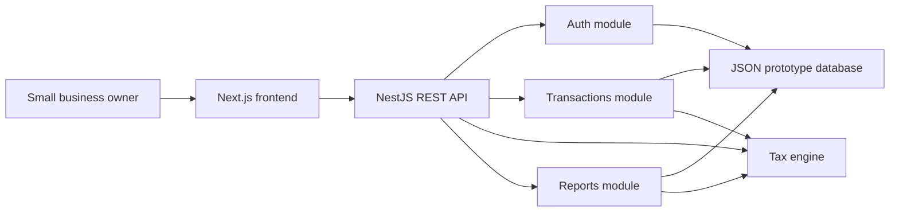
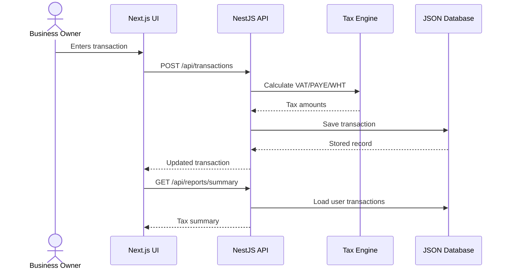
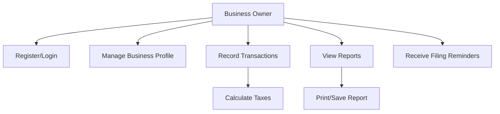
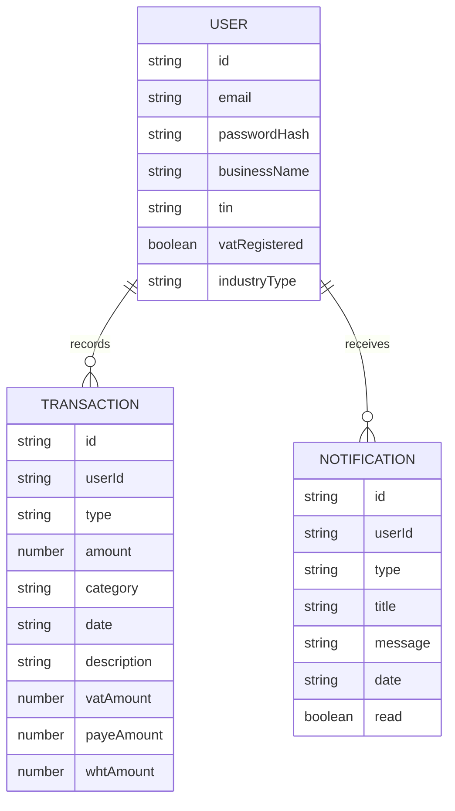

# Taxflow Final Year Project Notes

## Project Title

Design and Implementation of a Tax Filing Automation System for Small Businesses in Ghana.

## Overview

Taxflow is a web-based prototype that assists Ghanaian small businesses with transaction recording, automated tax estimation, report generation, and filing reminders. The system focuses on the practical workflow a small business owner follows each month: record transactions, calculate tax liabilities, review reports, and prepare for filing.

## System Architecture

## Main Modules

- Business profile: stores business name, email, TIN, industry, and VAT registration status.
- Authentication: provides prototype registration and login.
- Transactions: records income, expenses, and payroll.
- Tax engine: calculates VAT/NHIL/GETFund, PAYE, and withholding tax estimates.
- Reports: summarizes tax liabilities and business performance.
- Notifications: reminds users about filing deadlines.

## Data Flow

## Use Case Diagram

## ERD

## Tax Rules Used in Prototype

- VAT/NHIL/GETFund combined estimate: 20% for VAT-registered businesses.
- PAYE estimate: employee SSNIT deduction of 5.5%, then monthly graduated bands.
- Withholding tax estimate: goods 3%, works 5%, services 7.5%.
- PAYE and withholding tax reminder: 15th day of the following month.
- VAT/NHIL reminder wording: last working day of the following month.

Tax rates and deadlines are centralized in `backend/src/tax/tax.constants.ts` so they can be reviewed and updated.

## Testing Strategy

- Unit tests validate tax calculation formulas.
- Validation tests reject invalid transaction input and invalid report date ranges.
- Report tests verify summary totals and notification ownership behavior.
- Build checks confirm the frontend and backend compile successfully.

## Demo Script

1. Start the backend on `http://localhost:3001`.
2. Start the frontend on `http://localhost:3000`.
3. Register or use the demo account from `backend/data/demo-db.json`.
4. Show dashboard totals.
5. Record an income transaction and explain output VAT and WHT.
6. Record an expense transaction and explain input VAT and WHT withheld.
7. Record payroll and explain PAYE.
8. Open reports and show estimated tax owed.
9. Open notifications and explain deadline reminders.

## Limitations

- The project uses JSON storage to keep the prototype easy to run during assessment.
- Authentication is simplified and must be strengthened before production use.
- The system assists filing but does not submit returns directly to GRA.
- Tax guidance must be validated against current GRA publications before real use.
- Offline mode is useful for demonstrations but duplicates some logic from the backend.

## Future Work

- Replace JSON storage with PostgreSQL.
- Add secure password hashing and production-grade sessions.
- Split the frontend into reusable route-level screens and components.
- Add CSV import for transaction data.
- Add accountant/admin roles.
- Explore WhatsApp transaction entry.
- Investigate direct GRA integration if an official API is available.
